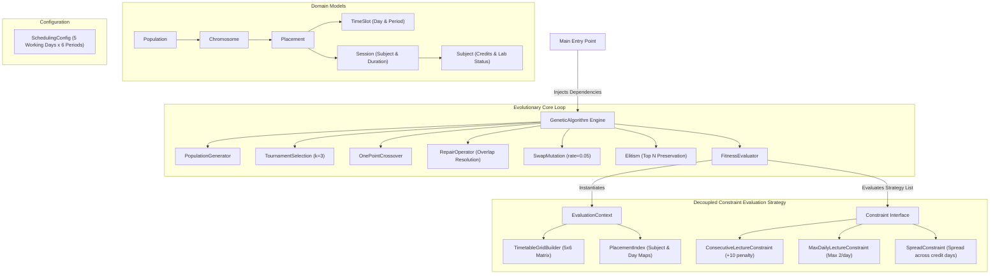
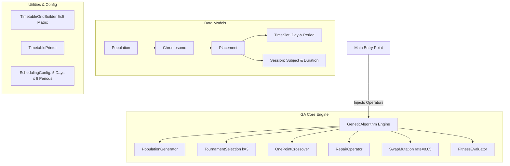

# Architecture & System Specifications

All architectural decisions, constraints, evolutionary conditions, and conflict resolution mechanisms for the **Genetic Timetable Generator** are documented here per iteration.

---

## 🚀 Iteration 2: Current System Architecture (Modular Constraints, Elitism & Indexing)

### 1. 🏗️ High-Level System Architecture Diagram

### 2. ⚙️ Iteration 2 Key Architectural Enhancements

#### **A. Preservative Elitism (`Elitism.java`)**
* **Purpose**: Prevents destruction of optimal solutions during crossover and mutation.
* **Mechanism**: Copies the top $N$ (default: `2`) fittest chromosomes (lowest penalty) from the parent population directly into the child generation before filling remaining slots with offspring.

#### **B. Open/Closed Constraint System (`Constraint.java`)**
* **Strategy Pattern**: `FitnessEvaluator` maintains a `List<Constraint>` and delegates evaluation to polymorphic constraint handlers.
* **Extensibility**: New hard or soft constraints can be implemented independently without modifying the evaluation engine.
* **Current Rules**:
  * `ConsecutiveLectureConstraint`: Checks 2D grid for back-to-back non-lab duplicate subjects (`+10` penalty per occurrence).
  * `MaxDailyLectureConstraint`: Limits non-lab lectures to a maximum per day (default `2`, `+10` penalty per excess lecture).
  * `SpreadConstraint`: Requires non-lab subject lectures to span across distinct working days matching subject credit requirements (`+10` penalty per missing day).

#### **C. High-Performance Evaluation Context (`EvaluationContext.java` & `PlacementIndex.java`)**
* **Single-Pass Grid & Index Construction**: `EvaluationContext` encapsulates `Chromosome`, pre-built `Placement[5][6]` grid matrix, and `PlacementIndex`.
* **$O(1)$ Hash Map Lookups**: `PlacementIndex` categorizes placements by `Subject` (`Map<Subject, List<Placement>>`) and `Day` (`EnumMap<Day, List<Placement>>`), eliminating redundant $O(N)$ array scans during constraint validation.

---
## 🚀 Iteration 1: Genetic Algorithm Engine Core ---------------------

### 1. 🛑 Constraints

#### ** Hard Constraints **
-  **No Overlapping Slots **: A single period slot in the 5×6 weekly grid can host at most one class placement (`grid[day][period] == null`).
-  **Multi-Period Duration Bounds**: Multi-period sessions (e.g., 2-period lab sessions) must fit entirely within the working day without exceeding the final period (`startPeriod + duration <= PERIODS_PER_DAY`).
- **Weekly Grid Boundaries**: All schedule placements are strictly bound to 5 working days (Monday–Friday) and 6 periods per day (30 total available slots per week).

#### **Soft Constraints**
- **Consecutive Lecture Penalty**: Avoids back-to-back scheduling of the exact same subject. Adjacent duplicate subject slots incur a `+10` penalty per occurrence.
* **Fitness Minimization**: A lower fitness score represents a better timetable (Target fitness: `0`).

---

### 2. ⚙️ Conditions

#### **Execution & Convergence Conditions**
* **Generational Limit**: Fixed termination condition set to **200 generations**.
* **Population Size**: Maintains a fixed size of **100 chromosomes** per generation.

#### **Operator Conditions**
* **Tournament Selection Size ($k=3$)**: Selects the best candidate parent out of 3 randomly picked individuals from the population.
* **Mutation Rate ($\mu = 0.05$)**: 5% probability per chromosome of triggering a random placement position swap.
* **Mutation Guard Condition**: `SwapMutation` strictly validates that randomly targeted swap destinations satisfy period bounds (`period + duration <= PERIODS_PER_DAY`).
* **Repair Trigger Condition**: `RepairOperator` is executed immediately after **crossover** and after **mutation** to guarantee valid grid layouts before evaluation.

---

### 3. 💥 Conflicts & Resolution

#### **Conflict Types**
* **Overlap Collision**: Occurs when crossover or mutation places two distinct sessions into overlapping grid cells.
* **Boundary Bleed**: Occurs when a multi-period placement starts too late in the day (e.g., period 5 for a 2-period lab).

#### **Conflict Resolution Mechanism (`RepairOperator`)**
* Builds a 2D grid matrix `Placement[5][6]` using `TimetableGridBuilder`.
* Scans for invalid placements and relocates conflicting sessions to the **first available contiguous free block**.
* > [!NOTE]
  > **Design Note**: The current repair mechanism rebuilds the grid per placement relocation ($O(N^2)$ complexity). Future iterations can optimize this using a `SlotAvailabilityTracker`.

---

### 4. 🏗️ Architecture Overview

#### **Architecture Highlights**
* **Constructor Dependency Injection**: `GeneticAlgorithm` is fully decoupled from concrete operator instantiations, receiving all dependencies via constructor injection for maximum flexibility and testability.
* **Layered Separation of Concerns**:
  * `model/`: Pure domain entities (`Subject`, `Session`, `TimeSlot`, `Placement`, `Chromosome`, `Population`).
  * `config/`: Centralized configuration (`SchedulingConfig`).
  * `ga/`: Evolutionary engine and dedicated single-responsibility operators.
  * `util/`: Grid representation builders and console formatting.