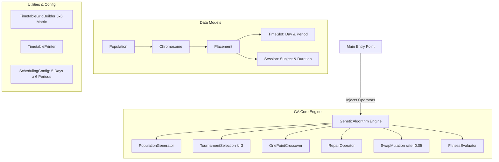

# Architecture & System Specifications

All architectural decisions, constraints, evolutionary conditions, and conflict resolution mechanisms for the **Genetic Timetable Generator** are documented here per iteration.

---

## 🚀 Iteration 1: Genetic Algorithm Engine Core ---------------------

### 1. 🛑 Constraints

#### ** Hard Constraints **
-  **No Overlapping Slots **: A single period slot in the 5×6 weekly grid can host at most one class placement (`grid[day][period] == null`).
-  **Multi-Period Duration Bounds**: Multi-period sessions (e.g., 2-period lab sessions) must fit entirely within the working day without exceeding the final period (`startPeriod + duration <= PERIODS_PER_DAY`).
- **Weekly Grid Boundaries**: All schedule placements are strictly bound to 5 working days (Monday–Friday) and 6 periods per day (30 total available slots per week).

#### **Soft Constraints**
- **Consecutive Lecture Penalty**: Avoids back-to-back scheduling of the exact same subject. Adjacent duplicate subject slots incur a `+10` penalty per occurrence.
* **Fitness Minimization**: A lower fitness score represents a better timetable (Target fitness: `0`).

---

### 2. ⚙️ Conditions

#### **Execution & Convergence Conditions**
* **Generational Limit**: Fixed termination condition set to **200 generations**.
* **Population Size**: Maintains a fixed size of **100 chromosomes** per generation.

#### **Operator Conditions**
* **Tournament Selection Size ($k=3$)**: Selects the best candidate parent out of 3 randomly picked individuals from the population.
* **Mutation Rate ($\mu = 0.05$)**: 5% probability per chromosome of triggering a random placement position swap.
* **Mutation Guard Condition**: `SwapMutation` strictly validates that randomly targeted swap destinations satisfy period bounds (`period + duration <= PERIODS_PER_DAY`).
* **Repair Trigger Condition**: `RepairOperator` is executed immediately after **crossover** and after **mutation** to guarantee valid grid layouts before evaluation.

---

### 3. 💥 Conflicts & Resolution

#### **Conflict Types**
* **Overlap Collision**: Occurs when crossover or mutation places two distinct sessions into overlapping grid cells.
* **Boundary Bleed**: Occurs when a multi-period placement starts too late in the day (e.g., period 5 for a 2-period lab).

#### **Conflict Resolution Mechanism (`RepairOperator`)**
* Builds a 2D grid matrix `Placement[5][6]` using `TimetableGridBuilder`.
* Scans for invalid placements and relocates conflicting sessions to the **first available contiguous free block**.
* > [!NOTE]
  > **Design Note**: The current repair mechanism rebuilds the grid per placement relocation ($O(N^2)$ complexity). Future iterations can optimize this using a `SlotAvailabilityTracker`.

---

### 4. 🏗️ Architecture Overview

#### **Architecture Highlights**
* **Constructor Dependency Injection**: `GeneticAlgorithm` is fully decoupled from concrete operator instantiations, receiving all dependencies via constructor injection for maximum flexibility and testability.
* **Layered Separation of Concerns**:
  * `model/`: Pure domain entities (`Subject`, `Session`, `TimeSlot`, `Placement`, `Chromosome`, `Population`).
  * `config/`: Centralized configuration (`SchedulingConfig`).
  * `ga/`: Evolutionary engine and dedicated single-responsibility operators.
  * `util/`: Grid representation builders and console formatting.